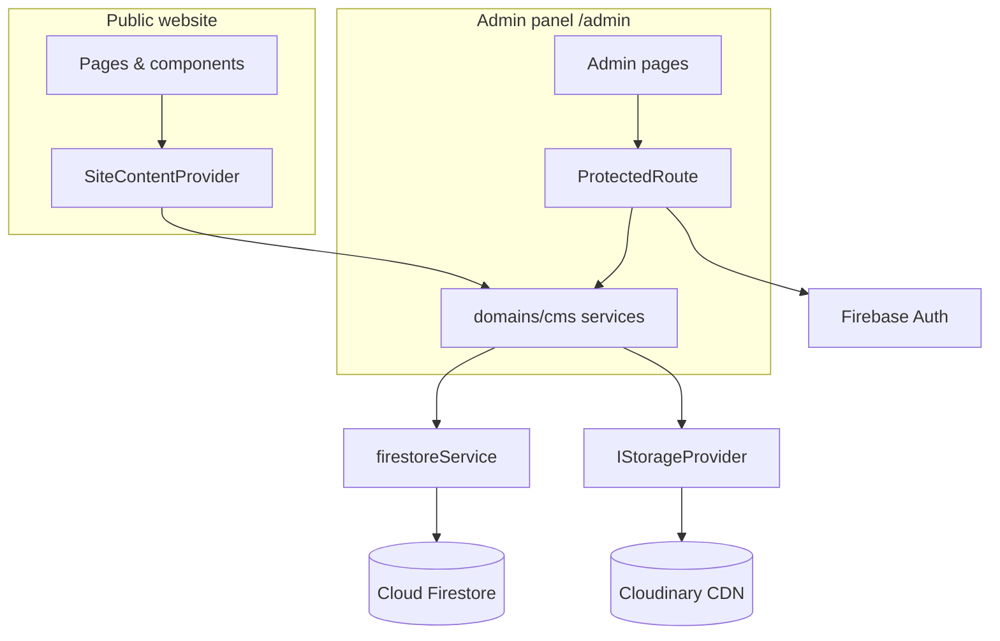
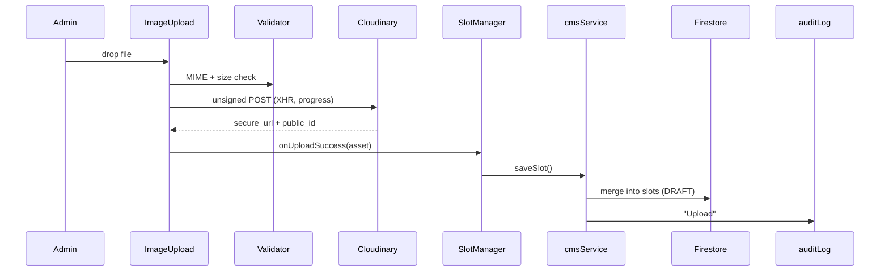
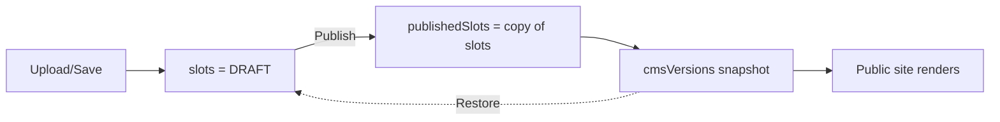
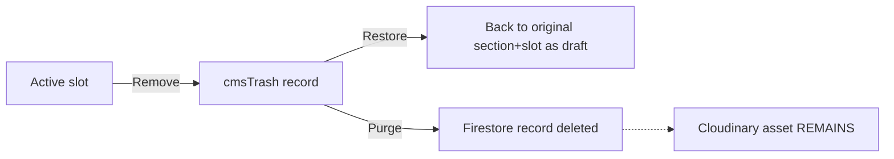

# CMS Architecture

Technical reference for developers maintaining the Alankaran CMS.

---

## Layering

Three rules hold the system together. Breaking any one of them is treated as a defect:

1. **No component calls Firebase directly.** All access goes through `firestoreService`, which
   accepts typed `FirestorePaths` values so an invalid document path cannot be constructed.
2. **No component calls Cloudinary directly.** All uploads go through `IStorageProvider`.
3. **One implementation per concern.** One slot catalog, one publication-state module, one gallery
   resolver. Duplicated comparison or path logic is a bug, not a style issue.



---

## Module reference

### Authentication — `src/services/auth/auth.service.ts`

- **Purpose:** wraps Firebase Auth email/password sign-in.
- **Dependencies:** `firebase/auth`, `userFacingError`.
- **Used by:** `AuthContext`, `ProtectedRoute`, every admin page needing `currentUser`.
- **Entry:** `login(email, pass)` · **Exit:** a Firebase `User`, or a thrown user-facing message.
- **Flow:** `AdminLogin → authService.login → onAuthStateChanged → AuthContext → ProtectedRoute`.

### Firestore access — `src/services/firestore/`

- **Purpose:** the single gateway to Firestore. Files: `firestore.service.ts` (CRUD, batch,
  transactions), `firestorePaths.ts` (typed addresses), `firestoreDiagnostics.ts` (write tracing).
- **Entry:** `save` · `update` · `get` · `delete` · `deleteMany` · `removeFields` · `list` ·
  `subscribe` · `runTransaction` · `executeBatch`.
- **Exit:** typed data, or a `FirestoreOperationError` carrying `.code`, `.op`, `.path`.
- **Note:** `save` is `setDoc(..., {merge:true})` and **cannot remove a map key**. Removing a slot
  requires `removeFields()`, which uses `deleteField()`.

### Storage — `src/storage/`

- **Purpose:** provider-agnostic image storage. `IStorageProvider` + `CloudinaryStorage`.
- **Entry:** `upload` · `replace` · `delete` · `getUrl` · `validate`.
- **Constraints:** unsigned uploads reject `return_delete_token` and `overwrite`, so `replace`
  creates a new asset and `delete` is a no-op that only detaches the CMS reference.

### Domain services — `src/domains/cms/services/`

| Service | Purpose |
|---|---|
| `cms.service` | Slots, publish, versions, trash, restore, global settings |
| `auditLog.service` | Writes/reads `cmsAuditLogs` |
| `cmsCache.service` | Two-tier cache (memory + localStorage), 30-min TTL |
| `cmsHealth.service` | Subsystem health for Diagnostics |
| `slotCoverage.service` | Catalog vs Firestore coverage report |
| `imageUsage.service` | Finds every reference to an asset before deletion |
| `inquiry.service` | Public contact-form submissions |
| `systemConfig.service` | `cmsSettings/system` runtime config |

### Public bridge — `src/providers/SiteContentProvider.tsx`

- **Purpose:** the only thing the public website talks to. Loads all sections once, caches them,
  and exposes resolution helpers.
- **Entry:** `getSlotImage(section, slot, fallback)` · `getGalleryImages()` · `useContactInfo()`.
- **Exit:** a resolved URL, always — falls back to a bundled asset when no CMS record exists.

---

## Data flows

### Image upload



The Cloudinary upload and the Firestore write are **separate steps**. A successful upload with a
failed save leaves an orphaned Cloudinary asset and no CMS record — `SlotManager` surfaces this
explicitly rather than showing the upload's success toast alone.

### Draft → Publish



The public site reads `publishedSlots`; the draft is invisible to visitors. Version restore loads a
snapshot **into the draft** — it never goes live without an explicit publish.

### Delete → Trash → Restore



Delete clears the slot from `slots`, `draftSlots` **and** `publishedSlots` via `removeFields()`.
Clearing the published copy is essential — publish only ever spreads the draft *over* the published
map, so a removal would otherwise never propagate.

Cloudinary assets are never destroyed. See "Known constraints".

### Global settings publication state

One module decides everything: `src/domains/cms/utils/globalSettingsDiff.ts`.

```
resolvePublicationState(rawDoc, defaults)
    publishedContact  →  contact (legacy)  →  DEFAULT_CONTACT_INFO
```

Consumed identically by `cms.service`, `SiteContentProvider`, the settings editor, and Diagnostics —
so the website and the CMS can never disagree about what is live. The `contact` step is
backward-compatible **read support**, not a migration: nothing is written on load.

### Activity log & diagnostics

Every mutation calls `auditLogService.log(action, user, target, details)` → `cmsAuditLogs`. Logging
is fire-and-forget and never blocks or fails a user action.

Diagnostics (`/admin/debug`) reports subsystem health, cache stats, slot coverage
(`slotCoverageService`) and settings coverage (`buildGlobalSettingsStatus`).

---

## Firestore schema

```
cmsSiteContent/{sectionKey}
  ├── slots            DRAFT image slots
  ├── draftSlots       mirror of slots
  ├── publishedSlots   LIVE — what the website renders
  ├── contact          DRAFT global settings   (contact doc only)
  └── publishedContact LIVE global settings    (contact doc only)

cmsVersions/{section}_{versionId}   immutable publish snapshots
cmsTrash/{trashId}                  soft-deleted slots + origin metadata
cmsAuditLogs/{logId}                administrative activity
cmsSettings/system                  runtime config
cmsInquiries/{inquiryId}            public contact-form submissions
```

All collections are top-level, so every document path is exactly two segments.

---

## Routing & auth

```mermaid
graph TD
    Req[Request /admin/*] --> Vercel[Vercel rewrite -> /]
    Vercel --> App[App.tsx]
    App -->|startsWith '/admin'| AdminRouter
    App -->|otherwise| PublicRouter[Public Router + SiteContentProvider]
    AdminRouter --> Protected[ProtectedRoute]
    Protected -->|no session| Login[/admin/login]
    Protected -->|session| Page[Admin page]
```

`MainContent` splits the tree on the `/admin` prefix, so the public site never mounts admin code and
the admin panel never mounts `SiteContentProvider`.

---

## Security model

- Firestore rules are the enforcement boundary. Every CMS collection requires `request.auth != null`.
- `cmsInquiries` allows anonymous `create` only, shape-validated in the rules themselves.
- A catch-all `match /{document=**} { allow read, write: if false; }` denies anything unmodelled.
- All `VITE_*` config is public by construction; no secret exists in the frontend.
- No `dangerouslySetInnerHTML` on any CMS-sourced value — React escapes by default.

---

## Known constraints

1. **Cloudinary assets are never deleted.** Destroying one needs a signed Admin API call and the
   secret must not reach the browser. Firestore is the source of truth; orphans accumulate until a
   server-side cleanup job exists.
2. **Replace creates a new asset.** Unsigned uploads reject `overwrite`, and reusing a `public_id`
   without it makes Cloudinary silently return the *existing* asset.
3. **Preview mode is unreachable.** The public-site toggle was removed at handover; `previewMode`
   remains in the provider, permanently `false`. Re-exposing it needs an admin-panel control.
4. **Publish is per-section**, not per-field.
5. **Destination Weddings is not CMS-managed.**
