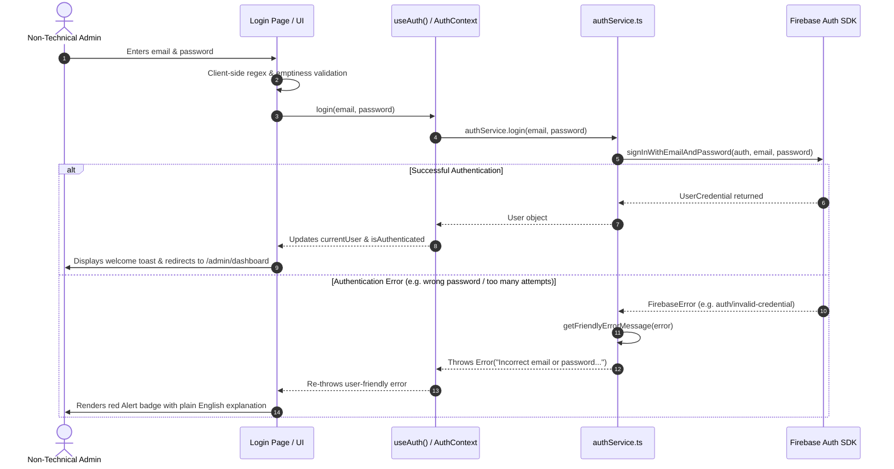

# Alankaran Custom Image CMS — Phase 1 Documentation

## Executive Summary
This document outlines the architecture, folder structure, environment configuration, and authentication flow for **Phase 1 (Authentication & Admin Foundation)** of the Alankaran Custom Image CMS.

Per strict project instructions, **Phase 1 focuses exclusively on setting up secure Firebase Authentication, protected administrative routing, session management, and luxury UI foundations**. No image upload capabilities, Cloudinary SDK calls, Firestore mutations, or modifications to the live public website have been introduced in this phase.

---

## 1. Folder Structure & Files Created

### New Files & Directories Created
```text
@workspace/alankaran/
├── .env.example                            # Template environment variables for Firebase configuration
├── docs/
│   └── CMS_PHASE1_DOCUMENTATION.md         # This documentation file
└── src/
    ├── lib/
    │   └── firebase.ts                     # Centralized singleton Firebase SDK initializations
    ├── services/
    │   └── authService.ts                  # Decoupled authentication service layer & error mapping
    ├── context/
    │   └── AuthContext.tsx                 # React Context Provider & useAuth hook
    ├── components/
    │   └── admin/
    │       ├── AdminLayout.tsx             # Responsive administrative dashboard sidebar & header layout
    │       ├── ProtectedRoute.tsx          # Route guard managing authentication state & redirects
    │       ├── AdminRouter.tsx             # Sub-router handling /admin/* URLs cleanly
    │       └── ui/                         # Reusable administrative UI components barrel
    │           ├── index.ts                # Re-exports for clean component imports
    │           ├── PasswordInput.tsx       # Password field with show/hide eye toggle
    │           ├── Loader.tsx              # Luxury golden loading spinner & status indicator
    │           └── PageHeader.tsx          # Consistent section title/description header with badge
    └── pages/
        └── admin/
            ├── index.ts                    # Barrel export for admin pages
            ├── Login.tsx                   # Polished luxury login screen with validation
            ├── Dashboard.tsx               # Primary dashboard with roadmap phase cards & status
            └── PlaceholderPage.tsx         # Reusable locked-state view for upcoming phases (2-6)
```

### Modified Existing Files
* **[package.json](file:///Users/vigneshchowdary/Downloads/Alankaran-main/package.json)** — Added official `firebase` (`^11.x`) dependency.
* **[tsconfig.json](file:///Users/vigneshchowdary/Downloads/Alankaran-main/tsconfig.json)** — Added `"types": ["node", "vite/client"]` for exact TypeScript resolution.
* **[src/entry-server.tsx](file:///Users/vigneshchowdary/Downloads/Alankaran-main/src/entry-server.tsx)** — Added explicit TypeScript typings for `wouter` routing hook and node stream callbacks during static site generation.
* **[src/App.tsx](file:///Users/vigneshchowdary/Downloads/Alankaran-main/src/App.tsx)** — Integrated `<MainContent />` component that checks `useLocation().startsWith("/admin")`. If an administrative route is visited, only `<AuthProvider><AdminRouter /></AuthProvider>` is rendered, cleanly hiding the public website `Navbar`, `FloatingCTA`, and `WhatsAppButton` without disturbing public routes.

---

## 2. Environment Variables Setup

Before running the application with live credentials, copy `.env.example` to `.env` or `.env.local` inside the project root and populate it with your Firebase Console Project credentials (`Project Settings -> General -> Your apps -> Web SDK`):

```env
VITE_FIREBASE_API_KEY="your-api-key-here"
VITE_FIREBASE_AUTH_DOMAIN="your-project.firebaseapp.com"
VITE_FIREBASE_PROJECT_ID="your-project-id"
VITE_FIREBASE_STORAGE_BUCKET="your-project.appspot.com"
VITE_FIREBASE_MESSAGING_SENDER_ID="your-sender-id"
VITE_FIREBASE_APP_ID="your-app-id"
```

> [!NOTE]
> **SSR & Static Prerender Safety:** `src/lib/firebase.ts` is engineered with build-time checks (`typeof window === "undefined"` and placeholder key detection). When `npm run build` executes Node-based static prerendering (`scripts/prerender.mjs`), dummy API credentials are substituted to prevent the Firebase SDK from throwing `auth/invalid-api-key` in headless server environments.

---

## 3. Authentication Architecture & Flow

The authentication architecture enforces separation of concerns: React UI components never interact directly with Firebase SDK functions.



### Key Components of the Flow:
1. **[authService.ts](file:///Users/vigneshchowdary/Downloads/Alankaran-main/src/services/authService.ts)** — Encapsulates `signInWithEmailAndPassword`, `signOut`, `getCurrentUser`, and `onAuthStateChanged`. Includes `getFriendlyErrorMessage()` to translate cryptic Firebase error codes into non-technical language.
2. **[AuthContext.tsx](file:///Users/vigneshchowdary/Downloads/Alankaran-main/src/context/AuthContext.tsx)** — Maintains active user state (`currentUser`, `loading`, `isAuthenticated`) via a permanent listener (`onAuthStateChange`).
3. **[ProtectedRoute.tsx](file:///Users/vigneshchowdary/Downloads/Alankaran-main/src/components/admin/ProtectedRoute.tsx)** — Intercepts navigation to `/admin/*`. Shows a full-screen luxury golden loader while session initialization is in progress (`loading === true`). If unauthenticated, triggers instant redirect to `/admin/login`.

---

## 4. Testing & Verification Checklist

To verify Phase 1 foundation thoroughly, execute the following checks:

- [x] **Compile & Build Test:** Run `npm run typecheck` followed by `npm run build`. Confirm 0 errors and successful pre-rendering of all 8 static public pages (`/index.html`, `/about.html`, etc.).
- [x] **Public Site Isolation:** Navigate to `/`, `/about`, `/gallery`, etc. Verify that the public website looks and functions exactly as before, with no admin overlays or UI disruptions.
- [x] **Unauthenticated Access Protection:** Navigate to `/admin/dashboard` in an incognito window or when logged out. Verify automatic redirection to `/admin/login`.
- [x] **Login Page Validation:** On `/admin/login`, attempt submitting an empty form or an invalid email (e.g., `notanemail`). Verify inline form validation alerts.
- [x] **Error Mapping:** Submit incorrect login credentials (`admin@alankaran.com` with `wrongpassword`). Verify user-friendly alert message (`"Incorrect email or password. Please verify your credentials and try again."`).
- [x] **Successful Authentication:** Sign in with the configured Firebase Admin credentials. Verify redirection to `/admin/dashboard`, display of active session details (`currentUser.email` and `uid`), and toast notification.
- [x] **Responsive Navigation & Mobile Drawer:** On `/admin/dashboard`, verify sidebar display on desktop (`≥768px`) and collapse behavior into a hamburger overlay drawer on mobile devices (`<768px`).
- [x] **Future Phase Placeholders:** Click on `Page Images`, `Gallery Manager`, `CMS Settings`, or `Activity Log` in the sidebar. Verify the display of the locked `PlaceholderPage` detailing the exact upcoming features scheduled for those phases.
- [x] **Logout & Session Termination:** Click `Sign Out` from the sidebar. Verify session termination, toast confirmation, and immediate redirect to `/admin/login`.

---

## 5. Recommendations Before Starting Phase 2

Before proceeding to **Phase 2 (Cloudinary Integration)** upon explicit user authorization, take note of these preparation guidelines:

1. **Cloudinary Unsigned Upload Preset:**
   In Cloudinary Dashboard (`Settings -> Upload -> Upload presets`), create an **Unsigned** preset named `alankaran_cms_preset`. Configure its default incoming transformations to `f_auto, q_auto` so that uploaded photos are automatically compressed and converted to WebP/AVIF format without requiring manual resizing by the client.
2. **Reuse Uploader UI Component:**
   In Phase 2, create `src/components/admin/ui/ImageUpload.tsx`. This component should leverage `Card`, `Button`, and `Spinner` already built in Phase 1, displaying drag-and-drop zones, live upload progress bars, and instant preview thumbnails.
3. **Keep Public Site Untouched Through Phase 3:**
   Continue adhering to the roadmap. Even when Phase 2 uploader (`/admin/images`) and Phase 3 Firestore saving (`cms/siteContent`) are complete, the public website (`src/pages/Home.tsx`, etc.) should remain untouched until **Phase 4 (Public Website Integration)**.
