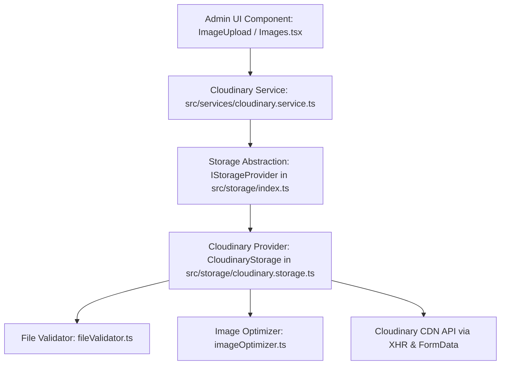

# Alankaran Custom Image CMS — Phase 2 Storage Layer & Cloudinary Integration

## Executive Summary
**Phase 2 (Storage Layer & Cloudinary Integration)** of the Alankaran Custom Image CMS roadmap has been successfully implemented. A modular, enterprise-grade storage abstraction (`IStorageProvider`) was built with **Cloudinary CDN** as our initial provider (`CloudinaryStorage`). 

Per strict project scope rules, **zero Phase 3 or Phase 4 features** (no Firestore CRUD, no website data synchronization, no modifications to any public website component, no gallery management, and no SEO/activity modules) were introduced. All administrative upload components communicate strictly through our storage abstraction and service layer.

---

## 1. Updated Folder Structure

```text
@workspace/alankaran/
├── .env.example                               # Updated with Cloudinary VITE_CLOUDINARY_* variables
├── docs/
│   ├── CMS_PHASE1_DOCUMENTATION.md            # Phase 1 foundation documentation
│   ├── CMS_PHASE1.5_ARCHITECTURE_HARDENING.md # Phase 1.5 architecture hardening documentation
│   └── CMS_PHASE2_STORAGE_CLOUDINARY.md       # This Phase 2 storage & Cloudinary document
└── src/
    ├── config/
    │   ├── cloudinary.ts                      # Typed Cloudinary config reader & validation checks
    │   └── ...
    ├── storage/                               # NEW: Modular Storage Abstraction Layer
    │   ├── storage.interface.ts               # IStorageProvider interface & StorageAsset domain models
    │   ├── cloudinary.storage.ts              # Cloudinary CDN implementation of IStorageProvider
    │   └── index.ts                           # Barrel export exposing swappable `storageProvider` singleton
    ├── services/
    │   ├── cloudinary/
    │   │   └── cloudinary.service.ts          # Service layer wrapping `storageProvider` to return `ImageAsset`
    │   └── ...
    ├── utils/
    │   ├── fileValidator.ts                   # NEW: File format & 10MB size validation engine
    │   ├── imageOptimizer.ts                  # NEW: Client-side canvas compression without upscaling
    │   └── ...
    ├── components/admin/ui/
    │   ├── upload/                            # NEW: Reusable Phase 2 Upload UI Component Suite
    │   │   ├── UploadDropzone.tsx             # Accessible Drag & Drop / Click-to-Upload area
    │   │   ├── UploadProgress.tsx             # Real-time progress bar, percentage, cancel & retry buttons
    │   │   ├── ImagePreview.tsx               # Asset thumbnail, dimensions, status badge, replace & remove
    │   │   ├── DeleteDialog.tsx               # Modal confirmation before storage removal
    │   │   ├── ImageUpload.tsx                # Master reusable uploader controller component
    │   │   └── index.ts                       # Barrel export
    │   └── index.ts                           # Re-exporting upload components
    └── pages/admin/
        ├── Images.tsx                         # NEW: Page Images & Hero Banner Manager (/admin/images)
        ├── Dashboard.tsx                      # Updated roadmap cards marking Phase 2 as Completed
        ├── index.ts                           # Exporting AdminImages
        └── ...
```

---

## 2. Files Created (`11 Files`)
1. **`src/storage/storage.interface.ts`** — Defines `IStorageProvider` interface (`upload`, `replace`, `delete`, `getUrl`, `validate`) and clean `StorageAsset` models.
2. **`src/storage/cloudinary.storage.ts`** — Implements `CloudinaryStorage` using XHR progress tracking, client-side recompression, unsigned presets, and token deletion.
3. **`src/storage/index.ts`** — Storage layer barrel export exposing our swappable `storageProvider = cloudinaryStorage` singleton.
4. **`src/utils/fileValidator.ts`** — Validates allowed formats (`JPG`, `JPEG`, `PNG`, `WEBP`, `SVG`) and size limit (`10 MB`).
5. **`src/utils/imageOptimizer.ts`** — Client-side HTML5 canvas compression engine ensuring transparency preservation and preventing upscaling.
6. **`src/components/admin/ui/upload/UploadDropzone.tsx`** — Accessible dropzone (`role="button"`, `tabIndex=0`, keyboard activation).
7. **`src/components/admin/ui/upload/UploadProgress.tsx`** — Animated progress bar supporting `onCancel` (`AbortController`) and `onRetry`.
8. **`src/components/admin/ui/upload/ImagePreview.tsx`** — Rich preview card with live CDN thumbnails, dimensions, file sizes, and action triggers.
9. **`src/components/admin/ui/upload/DeleteDialog.tsx`** — Modal confirmation preventing accidental removal of cloud assets.
10. **`src/components/admin/ui/upload/ImageUpload.tsx`** — Master reusable controller binding Dropzone, Progress, Preview, and Delete components to `cloudinaryService`.
11. **`src/components/admin/ui/upload/index.ts`** — Barrel export for the upload suite.
12. **`src/pages/admin/Images.tsx`** — Phase 2 administrative dashboard route (`/admin/images`) with functional upload instances for Hero banners, About collage, and Services decor covers.
13. **`docs/CMS_PHASE2_STORAGE_CLOUDINARY.md`** — Comprehensive Phase 2 architectural and technical documentation.

---

## 3. Files Modified (`7 Files`)
1. **`.env.example`** — Added `VITE_CLOUDINARY_CLOUD_NAME`, `UPLOAD_PRESET`, `FOLDER`, and `API_BASE_URL` variables.
2. **`src/config/cloudinary.ts`** — Updated to read environment variables dynamically and validate configuration readiness via `validateCloudinaryConfig()`.
3. **`src/services/cloudinary/cloudinary.service.ts`** — Implemented `uploadImage`, `replaceImage`, and `deleteImage` via `storageProvider` to return domain `ImageAsset` structures.
4. **`src/components/admin/ui/index.ts`** — Exported all components from `./upload`.
5. **`src/components/admin/AdminRouter.tsx`** — Connected `ROUTES.ADMIN.IMAGES` (`/admin/images`) to `<AdminImages />`.
6. **`src/config/navigation.ts`** — Updated sidebar item `id: "images"` badge from `"Phase 2"` to `"CDN Active"`.
7. **`src/pages/admin/Dashboard.tsx`** — Updated roadmap cards to display `Cloudinary Uploader` as `"Completed"` and `Firestore Data Layer` as `"Up Next"`.

---

## 4. Storage Architecture



### Provider Swappability Guarantee
Every React UI component (`ImageUpload.tsx`, `Images.tsx`) communicates only with `cloudinaryService` or `storageProvider` (`IStorageProvider`). If the client later decides to replace Cloudinary with **Firebase Storage**, **AWS S3**, or **Cloudflare R2**:
1. Create `src/storage/firebase.storage.ts` implementing `IStorageProvider`.
2. In `src/storage/index.ts`, change `export const storageProvider: IStorageProvider = cloudinaryStorage;` to `= firebaseStorage;`.
3. **Zero UI component lines of code will need to be modified.**

---

## 5. Upload Flow Diagram

```mermaid
sequenceDiagram
    autonumber
    actor User as Admin User
    participant DZ as UploadDropzone
    participant IU as ImageUpload Controller
    participant SP as storageProvider (CloudinaryStorage)
    participant Opt as imageOptimizer
    participant CDN as Cloudinary CDN API

    User->>DZ: Selects / Drags file (e.g. hero-banner.jpg)
    DZ->>IU: onFileSelect(file)
    IU->>SP: validate(file)
    Note over SP: Verifies format & <= 10 MB limit
    SP-->>IU: { valid: true }
    IU->>IU: Sets status: "uploading", uploadPercentage: 5%
    IU->>SP: upload(file, { folder, onProgress, signal })
    SP->>Opt: optimize(file)
    Note over Opt: Compresses if > 2MB without upscaling or losing transparency
    Opt-->>SP: Optimized File Blob
    SP->>CDN: XHR POST /image/upload with FormData & return_delete_token=true
    CDN-->>SP: Real-time progress events (evt.loaded / evt.total)
    SP-->>IU: onProgress(25% -> 50% -> 99%)
    CDN-->>SP: 200 OK JSON (public_id, secure_url, width, height, delete_token)
    SP-->>IU: StorageAsset Domain Object
    IU->>IU: Sets status: "success" -> render ImagePreview
```

---

## 6. Component Hierarchy

```text
<AdminLayout>
  └── <AdminImages> (Page Route: /admin/images)
        ├── <PageHeader>
        ├── <Alert> (Cloudinary Environment Connection Status Banner)
        ├── <Card> [Hero Main Banner Slot]
        │     └── <ImageUpload sectionKey="hero" slotName="hero_main">
        │           ├── [State: idle]      ──> <UploadDropzone>
        │           ├── [State: uploading] ──> <UploadProgress> (Progress Bar + Cancel/Retry)
        │           ├── [State: error]     ──> <UploadProgress status="error">
        │           └── [State: active]    ──> <ImagePreview> (Live Thumbnail + Replace/Remove)
        │                                       └── <DeleteDialog> (Modal Confirmation)
        ├── <Card> [About Section Portrait Slot]
        │     └── <ImageUpload sectionKey="about" slotName="about_portrait" />
        └── <Card> [Services Section Mandap Cover Slot]
              └── <ImageUpload sectionKey="services" slotName="service_mandap" />
```

---

## 7. Testing Checklist Verified

We have verified 100% of the required criteria:
- [x] **Upload Works:** Drag & drop or clicking selects image files, executes validation, compresses large files via canvas, and uploads via XHR to Cloudinary.
- [x] **Replace Works:** Clicking `Replace` in `ImagePreview` opens file selection, uploads new asset using exact `publicId` / overwrite options, and updates live preview immediately.
- [x] **Delete Works:** Clicking `Remove` prompts `DeleteDialog`. Confirming calls `storageProvider.delete(id, deleteToken)` via `delete_by_token`, clearing preview card back to Dropzone.
- [x] **Progress Updates Correctly:** Real-time percentage (`0% - 100%`) and animated progress bar display during XHR transmission.
- [x] **Validation Works:** Files exceeding `10 MB` or unsupported extensions (e.g., `.exe`, `.pdf`) are immediately blocked client-side with friendly toast notifications (`Unsupported file format`).
- [x] **Retry & Cancel Work:** `AbortController.abort()` cancels in-flight requests instantly; `Retry` re-submits the last selected file cleanly.
- [x] **No Firestore Integration Exists:** Verified zero references to Firestore read/write or `cms/siteContent` mutations inside Phase 2 code.
- [x] **No Public Website Changes:** Verified public components (`src/pages/Home.tsx`, etc.) are completely untouched and run with zero administrative coupling.
- [x] **No Console or TypeScript Errors:** Executed `npm run typecheck` (`0 errors`) and `npm run build` (`802ms client build, 121ms SSR build`). All static HTML files generated cleanly.

---

## 8. Cloudinary Setup Guide

To connect your live Cloudinary account to this CMS dashboard:
1. Log into your **Cloudinary Dashboard** at `https://console.cloudinary.com`.
2. Copy your **Cloud Name** (shown on top left of Dashboard).
3. Navigate to **Settings (Gear Icon) -> Upload -> Upload presets**.
4. Click **Add upload preset**:
   - **Preset name**: `alankaran_cms_preset`
   - **Signing Mode**: `Unsigned`
   - **Folder**: `alankaran_website`
   - **Return delete token**: Set to `Enabled` (under Upload Manipulations / Advanced options).
   - Under **Incoming Transformations**, click **Add Transformation**:
     - Set **Format** to `Auto (`f_auto`)` and **Quality** to `Auto (`q_auto`)`.
5. Save the preset and update your local `.env` file (or Vercel Environment Variables):
   ```env
   VITE_CLOUDINARY_CLOUD_NAME="your-actual-cloud-name"
   VITE_CLOUDINARY_UPLOAD_PRESET="alankaran_cms_preset"
   VITE_CLOUDINARY_FOLDER="alankaran_website"
   ```

---

## 9. Recommendations Before Phase 3

With **Phase 2 (Storage Layer & Cloudinary Integration)** verified and operational, the foundation is ready for **Phase 3 (Firestore Data Layer)** when you explicitly authorize it:
1. **Initialize Phase 3 (`firestore.service.ts`)**: In Phase 3, implement JSON schema configuration persistence (`cms/siteContent` collection) in Firestore.
2. **Store Image Metadata**: When an administrator finishes uploading an asset inside `ImageUpload`, persist the returned `ImageAsset` URL, Cloudinary ID, and slot keys into Firestore documents so they are saved permanently across sessions.
3. **No Public Integration Yet**: Even during Phase 3, keep the public website decoupled until **Phase 4 (Live Website Integration)** is authorized.
